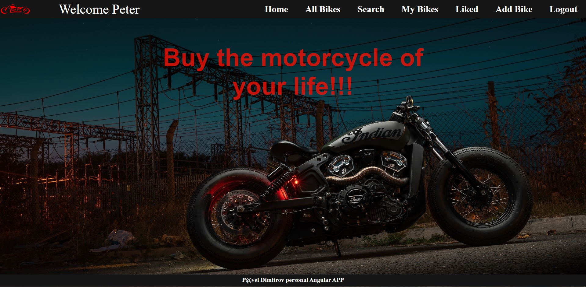

Motorcycle:

SPA  made for SoftUni-Angular course, created with Angular as FE, Node.js as BE and MongoDB as DB.

Informaton:

The app works as sale platform for motorcycles with basic functionality.
Every user(not logged in) have access to : Home , All Bikes (catalog), Search, Details, Register and Login.
Evry logged in user have acces to: Home, All Bikes (catalog), Search, My Bikes(if has liked bikes), Create, Edit(if has own bikes for edit) and Logout.
Every logged in user can like bikes and they automaticly are added to My Bikes.

TechStack
-Client
    Angular CLI: 14.2.8
    TypeScript: 4.7-.2
-Server
    Node: 17.2.0
    ExpressJS: 4.18.2
    bcrypt: 5.1.0
    jsonwebtoken: 8.5.1,
    mongoose: 6.7.4,
    nodemon: 2.0.20

Setup

To run app, in directory "motorcycle-app",  open inside cmd and run:

$ npm install

$ npm start

Which opens the app at http://localhost:4200 in your browser.
Also should run REST_API server.
Open directory "server", open inside cmd and run:

$ npm install

$ npm start

And the server will start listening on port 3000.
